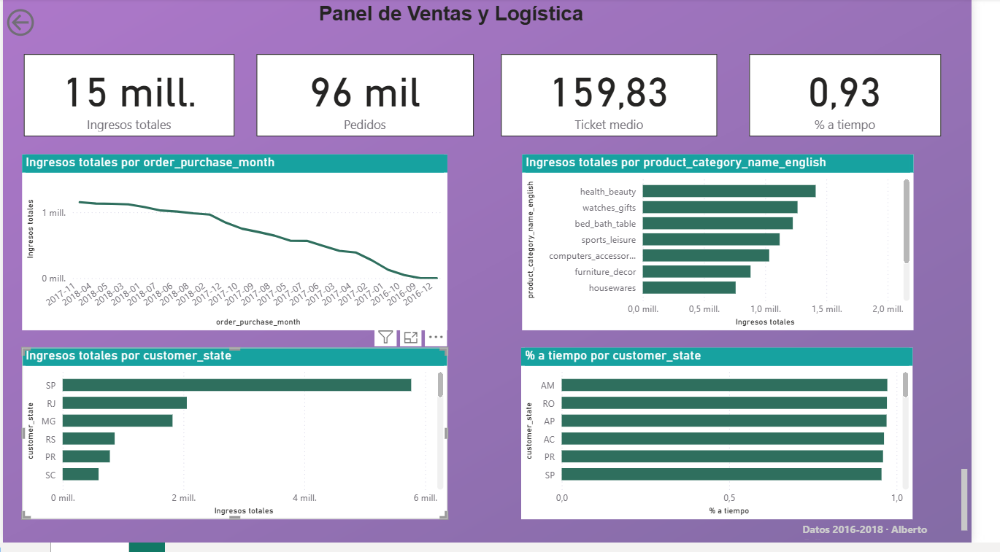

# Panel de Ventas y Logística — Olist (marketplace estilo Amazon)

Proyecto de análisis de datos end-to-end: limpieza y exploración con Python, consultas de negocio en SQL, y un dashboard interactivo en Power BI.

**Autor:** Alberto Gallego · proyecto 1 de portafolio (retail / e-commerce)

## Pregunta de negocio

¿Qué categorías, estados y vendedores impulsan más las ventas del marketplace, y dónde falla la logística (entregas fuera de plazo)?

## Dataset

[Brazilian E-Commerce Public Dataset by Olist](https://www.kaggle.com/datasets/olistbr/brazilian-ecommerce) — cerca de 99.000 pedidos de un marketplace real en Brasil (2016-2018). La estructura es muy parecida a la de Amazon: múltiples vendedores, catálogo de productos, envíos y reseñas de clientes.

## Estructura del repositorio

```
cuadernos/           → notebook de limpieza y EDA en Python (01_limpieza_y_eda.ipynb)
datos/procesados/     → tabla de ventas ya limpia (ventas_clean.csv)
SQL/                  → consultas de negocio (consultas.sql) y script para generar la base (crear_base_datos.py)
dashboard/            → captura del dashboard final en Power BI
```

## Proceso

1. **Python (pandas):** carga de los 8 CSV originales, limpieza de fechas, filtrado a pedidos entregados, cálculo de métricas de logística (días de entrega, retraso, % a tiempo) y construcción de una tabla de ventas a nivel de línea de pedido.
2. **SQL (SQLite):** 8 consultas de negocio sobre esa misma tabla — ingresos por mes, top categorías y estados, ticket medio, % de entregas a tiempo por estado, top vendedores, métodos de pago y categorías peor valoradas.
3. **Power BI:** dashboard interactivo con KPIs generales y 4 visualizaciones clave, construido sobre `datos/procesados/ventas_clean.csv`.

## Resultado: dashboard



## Insights clave

1. **Concentración geográfica:** São Paulo domina tanto en número de clientes como en ingresos — cualquier estrategia de stock o logística debería priorizar esa región.
2. **Categorías top:** un puñado de categorías (belleza y salud, relojes/regalos, hogar) concentran buena parte de los ingresos — son las candidatas claras para negociar mejores condiciones con esos vendedores.
3. **Logística como punto de dolor:** el % de entregas a tiempo varía bastante por estado — los estados más alejados del sudeste (norte y noreste de Brasil) tienen las peores tasas de entrega a tiempo, lo que probablemente explica parte de las reseñas más bajas en esas zonas.

## Cómo reproducirlo

1. Descarga el dataset de Kaggle y colócalo en `data/raw/` (no se sube al repo por su tamaño).
2. Ejecuta el notebook `cuadernos/01_limpieza_y_eda.ipynb` para generar `datos/procesados/ventas_clean.csv`.
3. (Opcional) Ejecuta `SQL/crear_base_datos.py` para generar una base SQLite local y probar las consultas de `SQL/consultas.sql`.
4. Abre Power BI Desktop y conecta el origen de datos a `ventas_clean.csv` para explorar el dashboard.

